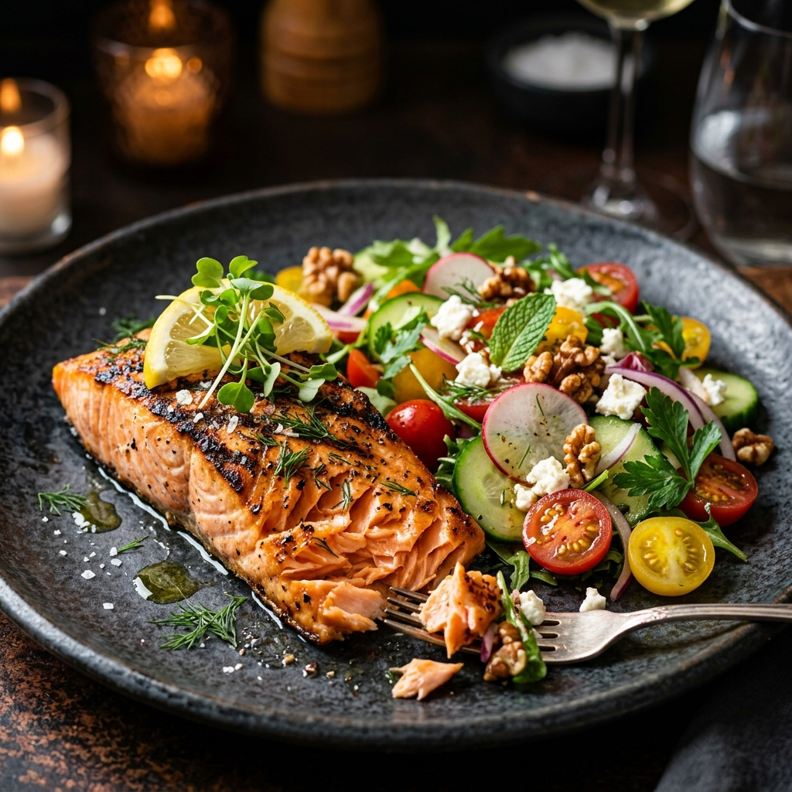
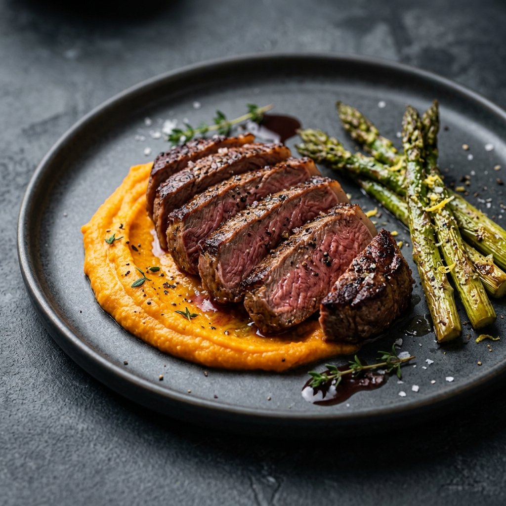
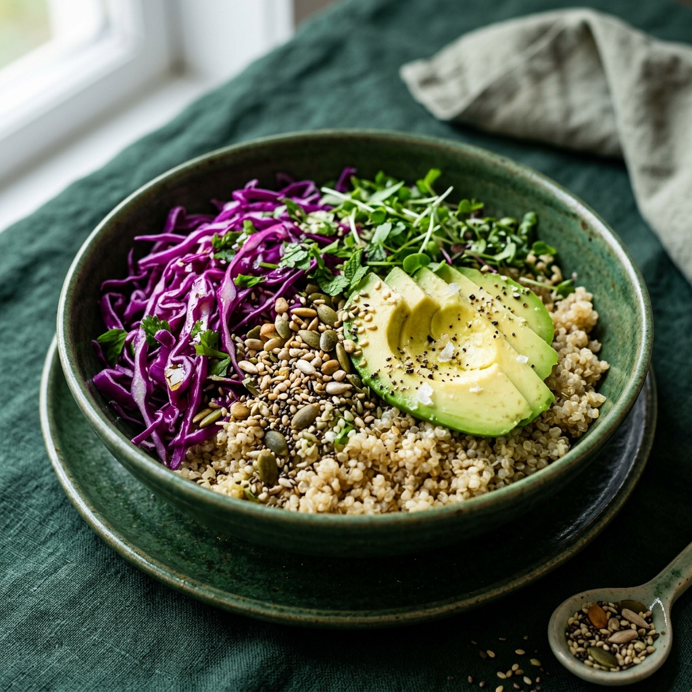
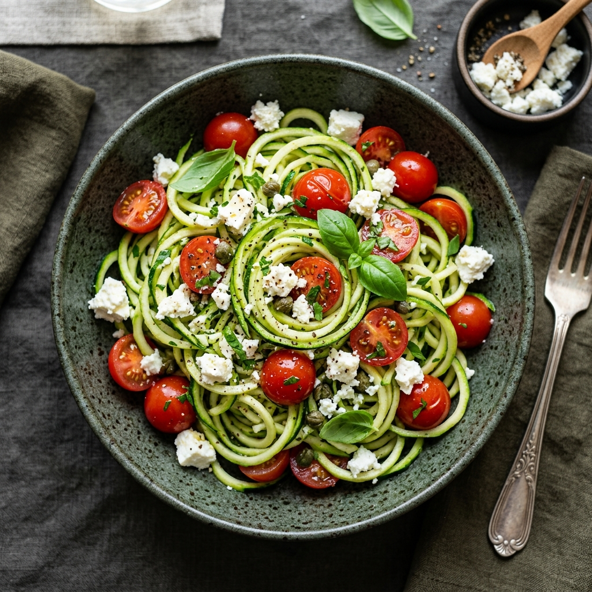

# 🟢 Lumina Greens – Premium Diet & Slimming Landing Page

## 📌 Overview
**Lumina Greens** is a modern, high-conversion landing page designed for a premium restaurant specializing in gourmet, calorie-controlled meals.

The concept focuses on delivering a **"Healthy & Luxury"** experience — not a boring diet brand, but a visually rich and appetizing culinary journey.

---

## 🎯 Key Features

- ⚡ **Modern UI/UX Design**
  - Minimalist and high-contrast layout
  - Clean, airy spacing for better readability

- 🥗 **Dynamic Menu Carousel**
  - Filter meals by:
    - Weight Loss
    - Muscle Gain
    - Detox
  - Displays calorie count per meal
  - Includes "Quick Add" interaction button

- 💳 **Meal Plan Subscription**
  - Toggle between:
    - Weekly plans
    - Monthly plans
  - Structured pricing table

- 🎨 **Premium Visual Identity**
  - Primary colors:
    - Deep Forest Green / Matte Charcoal
  - Accent colors:
    - Vibrant Lime / Soft Pear
  - Typography:
    - Playfair Display (Headings)
    - Inter / Montserrat (Body)

---

## 🧩 Layout Structure

### 1. Hero Section
- Split-screen layout:
  - Left: Bold, elegant typography
  - Right: High-quality food imagery with parallax effect
- Strong Call-to-Action

### 2. "Why Us" Section
- Clean icon-based grid featuring:
  - Keto-Friendly
  - Zero Refined Sugar
  - Macro-Tracked

### 3. Menu Carousel
- Interactive slider component
- Meal cards include:
  - Image
  - Calories
  - Quick Add button

### 4. Subscription Plans
- Pricing table layout
- Toggle switch (Weekly / Monthly)

---

## ✨ Animations & Interactions

- 🎬 **Scroll-Triggered Animations**
  - Fade-in with upward motion

- 🖱️ **Hover Effects**
  - Subtle scaling on cards
  - Glow or color-fill transitions on buttons

- 🌿 **Parallax Effects**
  - Floating ingredient elements (e.g., spinach, lemon)

- 🔝 **Micro-interactions**
  - Scroll progress bar
  - "Back to Top" button

---

## 🛠️ Tech Stack

- HTML5
- CSS3 (Flexbox / Grid)
- JavaScript (Vanilla or React)
- Optional:
  - GSAP (for advanced animations)
  - Framer Motion (if using React)

---

## 📱 Responsiveness
Fully responsive design optimized for:
- Mobile devices
- Tablets
- Desktop screens

---

## 🚀 Project Goal
To create a visually appealing, high-performance landing page that:
- Enhances user engagement
- Reflects a premium healthy lifestyle brand
- Increases conversion rates

---

## 📸 Preview & Assets

To give you a glimpse of the premium culinary journey, here are the featured meals in our landing page:

| Hero Section | Muscle Gain |
|:---:|:---:|
|  |  |
| *Signature Grilled Salmon* | *High-Protein Muscle Meal* |

| Detox Plan | Weight Loss |
|:---:|:---:|
|  |  |
| *Fresh Detox Bowl* | *Calorie-Controlled Weight Loss* |

---

## 👨‍💻 Author
**Hossam**  
Frontend Developer

---

## 📄 License
This project is for portfolio and educational purposes.
